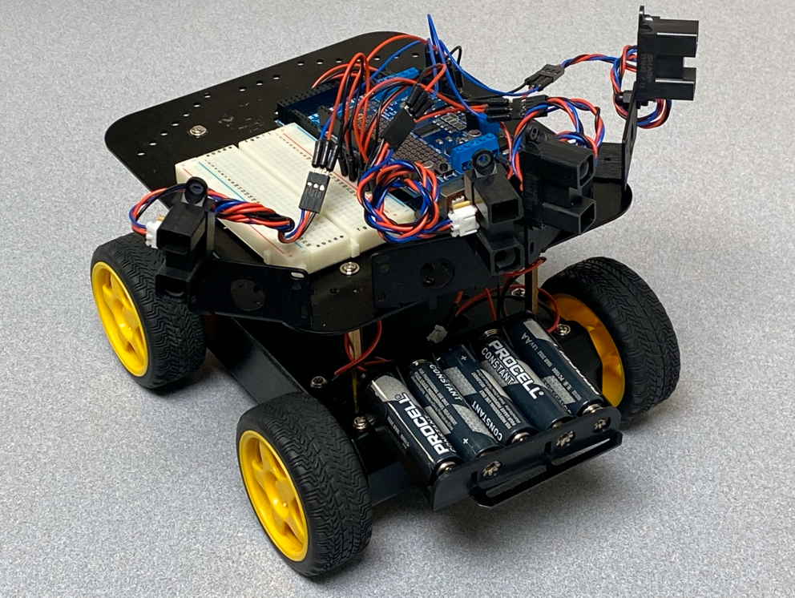
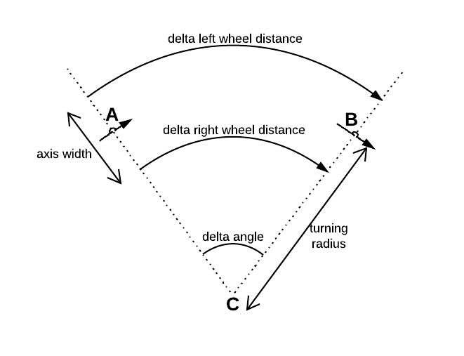
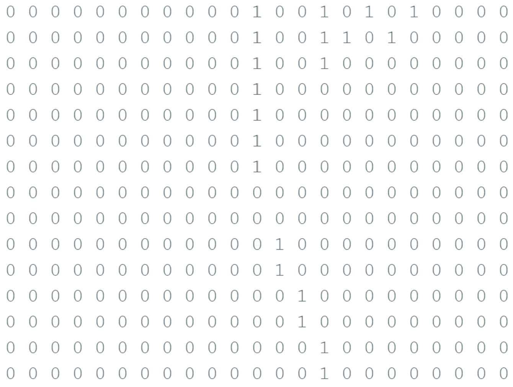

# Mappo the Explorer
## Jamal Mahdi and Eli Nutter



## Motivation
The visually impaired are faced with daily dilemma’s living in our world. The ability to see and map the world around us is vital to daily living. Our core motivation is to provide a safe way for those people to be aware of their surroundings. 

## Goal
Construct a mobile robot capable of mapping the area surrounding it. It will traverse the region in its immediate vicinity, looking for and storing data about the location of obstacles. In further iterations, outside of this proof of concept, this data can be fed to devices for use by those who require them. Such devices can be used by museums, warehouses, or other large buildings to allow easy access to the visually impaired.

## Technical Description
This robot is a small mobile machine, using motor-driven wheels as its primary mobility source. A total of four IR sensors are attached to the front. This data is used for both obstacle avoidance and local area mapping.

Obstacle avoidance is using the “AP Lite” algorithm. It works by creating a virtual force that pushes the robot away from any nearby obstacles. This allows the robot to drive next to walls and turn away when approaching an object. 

Local area mapping is implemented with a grid-based discovery algorithm. The robot moves to a point and then stores data about what is around it to a global grid. It chooses a direction to move and continues this process.

# Obstacle Avoidance
The obstacle avoidance algorithm works by producing virtual forces between the robot and obstacles. Changing forces affects the robot’s velocity, thereby allowing robot to make necessary adjustments to distance to obstacles. This allows the robot to behave as a spring that remains in its equilibrium state.

All of the code below is in a function called `ap_lite()`. Currently this code is in the `Main.ino` file. However, this would ideally be the `RobotController` class.
```cpp
for (all sensors):
    range = distanceToReact - sensor.reading
    if range < 0:
        range = 0
    F = HooksConstant * range
    Fx = F * cos(sensor.angle)
    Fy = F * sin(sensor.angle)
```
For each sensor, we grab the sensor reading and determine if it’s in our detection range. If the sensor reading is greater than the distance to react, `F` – our reaction force – becomes zero. Note that `HooksConstant` is just a multiplier that can be changed to adjust sensitivity to surroundings.


```cpp
delta_vx = Fx / Mass
delta_vy = Fy / Mass

vx += delta_vx
vy += delta_vy

velocity = sqrt(vx^2 + vy^2)

// The change in angle from change in velocity
delta_angle = atan(delta_vy, delta_vx)
```
Here we calculate the difference in velocity, based on the forces generated. Here, we always use `Mass = 1` since the actual weight of the robot doesn't matter. 

Also, `vx` and `vy` are global variables keeping track of the current velocity of the robot.

```cpp
// Calculate the new angle to turn
if (delta_angle is in second quadrant):
    turn_angle = PI - delta_angle
    
if (delta_angle is in third quadrant):
    turn_angle = -PI - delta_angle

// Apply power to motors to actually turn
if (turn_angle is in the first OR fourth quadrants):
    power_right = v + v * w
    power_left = v - v * w

robot.right_power(power_right)
robot.left_power(power_left)
```
This is the final step where we apply power to the motors. We test whether the turn angle is in the second or third quadrant, as that changes how we use `PI`, then calculate the actual power required.

# Mapping
Mapping, especially without using GPS, is a difficult issue to solve. In essence, this is situational awareness and localization of one’s environment. Humans do this well, as they have vast swaths of sensor data, such as eyesight, hearing, smell, touch, and a directional memory. Meanwhile, our robot only has several infrared sensors.

To solve this issue, we assume the robot starts in the center of the map. Then, we take the input from each sensor and map it to a 2d array. If the sensor pings something, we calculate where from the robot that is. Then, we use where the robot is in the map to calculate the location of the ping. This location correlates to a cell on the 2d array, and we +1 the value of that cell.

We implement this using a "Bresenham Line Algorithm."

## Plot Points

```cpp
plot_points(float theta, float r)
```
The code below, until specified, is inside of this function `plot_points()`. The argument `theta` is `SENOR_ANGLE + TURN_ANGLE`. Where `SENSOR_ANGLE` is the angle of the sensor, with respect to the front of the robot. `TURN_ANGLE` is angle of the front of the robot, with respect to the global map.

For example, the robot starts at at angle 0 on the global map. If it turns 45 degrees, then `TURN_ANGLE` is 45 degrees. If we have a sensor facing at 15 degrees, then `theta` is 60 degrees. 

The argument `r` is simply the distance the sensor detected the obstacle at, in inches.
```cpp
r = r/cell_size

x1 = r * cos(theta)
y1 = r * sin(theta)
```
We have to take the distance, and adjust it for the size of each cell. In our testing, the cell size was 6 inches. Therefore, if `r` was input as 6, then it gets converted to 1.

We also convert from polar coordinates into cartesian.

```cpp
x2 = r + 3 * cos(theta);
y2 = r + 3 * sin(theta);

dx = abs(x2 - x1);
dy = abs(y2 - y1);
```

Here we create a point `(x2, y2)` that exists at the same angle as `(x1, y1)`, but is further away from the robot. Our goal is to draw a line between these two points, and map that on our grid.

We also calculate the distance, `dx` and `dy`, from `(x1, y1)` to `(x2, y2)`

```cpp
slope_less_than_one = false;

if (dx > dy) {
    slope_less_than_one = true;
}
```

Next we have to determine if the slope of the line `(x1, y1) -> (x2, y2)` is less than or greater than 1. This changes which quadrant we map the point in.

```cpp
pk = 2 * dy - dx;
```

`pk` is referred to as a "decision making parameter." It decides whether we need to increment in the y-dimension. 

Think of it like this: We're trying to determine if a line falls into a particular cell. In each iteration of the loop we're moving in the x direction. If the line goes up far enough, we need to move in the y direction to keep up.

 

```cpp
for (int i = 0; i <= dx; i++):
    x1 < x2 ? x1++ : x1--
    
    if (pk < 0):
        if (slope_less_than_one):
                plot(x1, y1);
                pk = pk + 2 * dy;
            else:
                plot(y1, x1);
                pk = pk + 2 * dy;
            
    else:
        y1 < y2 ? y1++ : y1--
        if (slope_less_than_one)
            plot(x1, y1)
        else:
            plot(y1, x1)
        
        pk = pk + 2 * dy - 2 * dx;
```

Here is where the magic happens. There are four lines of logic, depending on the value of the slope and `pk`. If `pk` is negative, we map normally. If `pk` is positive, then move in the y-dimension.

The slope determines whether we plot the point normally `(x, y)`, or if we swap `x` and `y` into `(y, x)`.

## Plot

```cpp
plot(x, y)
```

The `plot()` function takes an `x` and `y` coordinate that is relative to the robot. Then, it converts it to coordinates on the global map.

```cpp
i = 0
j = 0
```

`i` and `j` are going to be the indexes in the array for the cell that `(x, y)` maps to.

```cpp
if (x >= 0 and y > 0):
    // Quadrant 1
    i = location_x + x
    j = location_y - y

if (x < 0 and y <= 0):
    // Quadrant 2
    i = location_x - x
    j = location_y - y

if (x <= 0 and y < 0):
    // Quadrant 3
    i = location_x - x
    j = location_y + y

if (x > 0 and y <= 0):
    // Quadrant 4
    i = location_x + x
    j = location_y + y
```

`location_x` and `location_y` are the current location of the robot within the map.

The quadrant that `x` and `y` are located in is important. Depending on the quadrant, we either have to add or subtract `x` and `y` to get the correct location on the map. In essence, we are converting from the local reference frame of the robot, to the global reference frame of the map.

```cpp
if (i < map_size and j < map_size):
    map[i][j] += 1
```

If we are in bounds, then increment the map.

# Positioning System
We can avoid obstacles and we can map the environment. Now, we have to use the data from the obstacle avoidance to update the robot position in the map. This ties everything together.


## Measuring wheel travel
Measuring how far wheels have traveled is typically done with an encoder. However, our test bed does not have one. This means we cannot ever know how far the robot has moved. Except we might be able to estimate it.

Measuring the RPM at different degrees of power (10%, 20%, etc.), we can deduce a formula to estimate the RPM at any given power percentage. Then, we can time how long the wheels have been at a given RPM. Using the circumference of the wheel, you can estimate how far you have traveled.

Our testing revealed we can estimate the Revolutions per Second (RPS) with the following:

`RPS = 0.166 * Motor Power`

This is only an estimation. It was also an estimation based on data where the wheels were free-floating in the air. The extra pressure from the weight of the robot will probably adjust the values we measured. Whether this matters has yet to be tested.

For the numbers used to derive this, see the Excel document in the `/docs/` folder.

## Converting to x and y

This gets quite math heavy. While traveling in a straight line is simple, our robot, and our avoidance algorithm, uses a differential drive. So, while the right side might be at 20%, the left could be 100%. This introduces more trigonometry. 



We have a theoretical function, down below, that does this.

```cpp
mapNewLocation()
```

```cpp
leftRps = 0.166 * robot.speedLeft()
rightRps = 0.166 * robot.speedRight()
```
First we calculate the speed, in RPS, of the left and right motors.

```cpp
timeTraveled = (CurTimeMillis() - LAST_TIMESTAMP) / 1000
```

Next we have to calculate the time traveled. The `LAST_TIMESTAMP` variable is updated at the end of every `ap_lite()` call. Divide this by 1000 to get the `timeTraveled` in seconds.

```cpp
leftDelta = CIRCUMFERENCE * leftRps * timeTraveled;
rightDelta = CIRCUMFERENCE * rightRps * timeTraveled;
```

Multiplying everything together gives us the "delta." This is how much we have moved, in inches, per each wheel.

```cpp
if (abs(leftDelta - rightDelta) < 1.0e-6):
    new_x = map.x + leftDelta * cos(robot.angle)
    new_y = map.y + rightDelta * sin(robot.angle)
    new_heading = TURN_ANGLE
```

If the absolute value of `leftDelta` and `rightDelta` is small enough, we're basically going straight. In that case, the new position is easy to calculate.

We have to get the current `x` and `y` position from the map. We also need the robot's `TURN_ANGLE` with respect to the map.

```cpp
else:
    R = unitsAxisWidth * 
        (leftDelta + rightDelta) / 
        (2 * (rightDelta - leftDelta))
    
    wd = (rightDelta - leftDelta) / unitsAxisWidth

    new_x = map.x + R * sin(wd + robot.angle) - R * sin(robot.angle)
    new_y = map.y - R * cos(wd + robot.angle) + R * cos(robot.angle)
    new_heading = boundAngle(robot.angle + wd)

```

Otherwise... it's complicated. 

```cpp
map.move(x, y);
robot.turn_angle(new_heading);
```

At the end of the function, we update the map with our new position, and the robot with the turn angle.

# Test Bed
The robot is built using the DFRobot 4WD Mobile Platform. It is powered using up to 5 AA batteries. The computing power comes from an Arduino MEGA, with an Adafruit Motor Shield providing power to the motors. Connected to these are four SHARP IR sensors.

## Evaluation
This robot’s construction requires an iterative approach towards testing. We start small, putting it in a box with some small obstacles. As the robot becomes more consistent, we extend the size of the room, and increase the complexity of the obstacles. The final testing phase will be conducted in various rooms of all sizes, shapes, and configurations.
To facilitate the testing environment of the robot, we have designed several tests to be used for evaluating the progress of the system. 

### AP Lite Obstacle Avoidance Test `passed`
Power on the robot and have it face a wall (variances of this test will have the robot face at various angles). Let it run and notice its behavior. A successful test is complete if the robot does not crash into any detectable objects.

### Mapping Algorithm Test `passed`
Supply the mapping algorithm with test data. The robot needs to be on, but does not need to move. Ensure it can map values in all four quadrants. When mapping is complete, print the map to verify. 



The printed map after a test case.

### Movement Accuracy Test `not tested`
Place the robot on a marker on the ground, then turn it on. Let the robot move in a random direction. Afterward, it should return to the original location on the marker.

### Advanced Movement Accuracy Test `not tested`
Similar test as before but configure the bot to move in a series of random directions and random times. Log these in an array. Back track to the starting location.

### Obstacle Avoidance Mapping Test `not tested`
Place the robot on a marker within a small and closed off test environment. Then, turn it on. After the robot has fully traversed the environment, it will return to the starting location for 15 seconds. At this point, it will begin to traverse the environment again using only the mapping data.

# Current Progress and Reflection
It's reasonable to say the robot is about half-way completed. Obstacle avoidance and mapping are implemented. However, the integration between the two only exists as a hypothesis. 

It certainly feels like we're a lot closer than we probably are. After implementing the `mapNewLocation()` function, we should be done. That doesn't take into account testing and bug fixing. Which is why we conclude about 50% completion on the project. 

We initially started this project thinking it was going to be quite simple. A stupid Roomba does it, why can't we? Turns out, that assumption was incredibly wrong. Mapping an environment is not a set in stone process, and it required a lot of critical thinking (also a lot of white board space) to make any sort of progress. 

We are proud of what we've made; much has been learned in this process. Perhaps some day we'll come back to it, and take the several months it will require to finish.

# References

[Bresenham's Line Algorithm](https://www.geeksforgeeks.org/bresenhams-line-generation-algorithm/#)

[Wheels and distance moved](http://cmra.rec.ri.cmu.edu/previews/rcx_products/robotics_educator_workbook/content/mech/pages/Diameter_Distance_TraveledTEACH.pdf)

[Position of differential drive](https://robotics.stackexchange.com/questions/1653/calculate-position-of-differential-drive-robot)